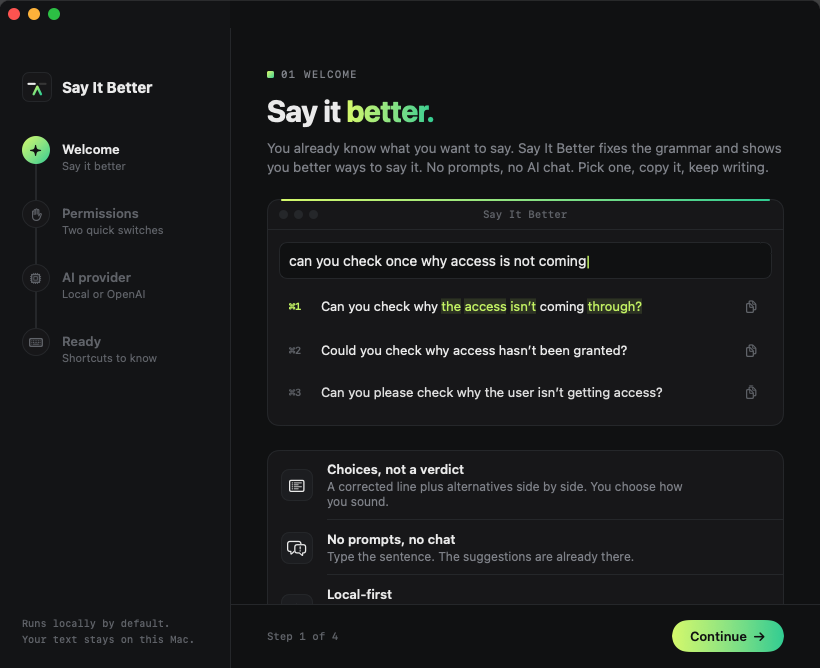
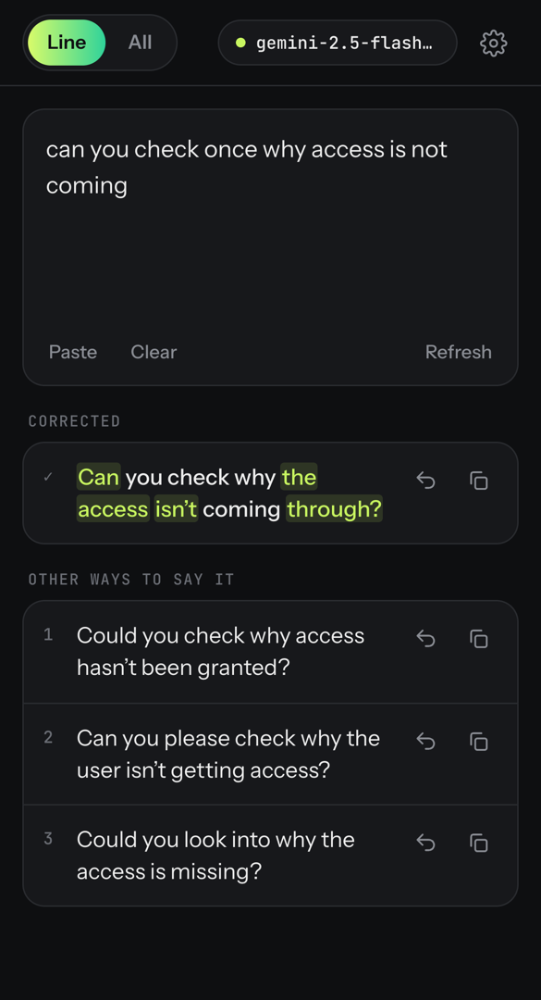

<div align="center">


# Say It Better

**Grammar fixes and better ways to phrase what you mean. No prompting. No AI chat. Just write.**

[**Use it on the web**](https://vexcoredev.github.io/sayitbetter/app/) &nbsp;·&nbsp;
[**Download for Mac**](https://vexcoredev.github.io/sayitbetter/downloads/SayItBetter.dmg) &nbsp;·&nbsp;
[Website](https://vexcoredev.github.io/sayitbetter/)

</div>

<p align="center">
  
  &nbsp;
  
</p>

## What it does

You already know what you want to say. Say It Better helps you say it better without interrupting you.

Type or paste a sentence. In a second or two you get:

- **The corrected line**: spelling, grammar and punctuation fixed, with every changed word highlighted so you can see what moved.
- **Other ways to say it**: a few rewrites with the same meaning, whether clearer, shorter, friendlier or more professional.

Tap one to copy it, or drop it back into your text. That's the whole app.

**Why not just ask a chatbot?** The usual way is: write → copy → open ChatGPT → paste → type a prompt → wait → copy → switch back → paste.
With Say It Better it's: **write → choose → copy.**

- **Choices, not a verdict.** AI doesn't decide what you meant. You pick how you sound.
- **No prompts, no chat.** Type the sentence; the suggestions are already there.
- **A utility, not a destination.** Open it, fix the line, get back to work.

## Use it on the web: phone or computer

Works in any modern browser, with nothing to download.

1. Open **[vexcoredev.github.io/sayitbetter/app](https://vexcoredev.github.io/sayitbetter/app/)**.
2. Install it if you like, so it opens full-screen like a regular app:
   - **iPhone / iPad:** Safari → **Share** → **Add to Home Screen**
   - **Android / PC:** Chrome or Edge → **Install app** (in the address bar or menu)
3. Pick an AI on first launch. Both free options work well:

| AI | Cost | Privacy | Notes |
|---|---|---|---|
| **Google Gemini** *(recommended)* | Free key | Text goes to Google | Fast and polished. Get a key in a minute at [Google AI Studio](https://aistudio.google.com/apikey). |
| **On this device** | Free, no account | Nothing leaves your device | Downloads a small model once (Qwen 2.5 0.5B, ~300 MB, or Google Gemma 3 1B, ~700 MB), then works offline. Needs WebGPU: recent Chrome or Edge, or Safari 26+. Simpler rewrites. |
| Groq | Free key | Text goes to Groq | Very fast open models. |
| OpenAI · Claude | Paid, per use | Text goes to that provider | Bring your own API key. |
| Custom | Your server | Your server | Any OpenAI-compatible endpoint, e.g. Ollama on your own machine. |

Your API key is stored only in that browser on that device, and is sent only to the provider you picked. There's no Say It Better server in between.

**Line / All:** work on the line you're typing in, or on the whole text.

## Mac app

Everything above, plus features that only a native app can do:

- **Autocomplete in any app.** Grey suggested text appears at your cursor in Mail, Notes, Slack, browsers and more.
  <kbd>⇥</kbd> takes the next word, <kbd>⌥</kbd><kbd>⇥</kbd> the whole suggestion, <kbd>esc</kbd> hides it.
  Password fields are never read; Terminal, code editors and password managers are excluded by default.
- **Suggestions panel** as a window or from the **menu bar**. Copy an alternative with <kbd>⌘1</kbd>…<kbd>⌘9</kbd>.
- **Local by default.** Runs on [Ollama](https://ollama.com) on your Mac, so your text never leaves it. OpenAI, Claude or
  Apple Intelligence (macOS 26+) are there if you want them. Keys are kept in the macOS Keychain.

**Requirements:** macOS 14 Sonoma or later, on Apple Silicon or Intel. Apple Silicon is recommended for local models.

**Install:** download [SayItBetter.dmg](https://vexcoredev.github.io/sayitbetter/downloads/SayItBetter.dmg), open it and drag
**Say It Better** into Applications.

> [!NOTE]
> The app isn't notarized by Apple yet, so macOS blocks the first launch. Right-click (or Control-click) the app in
> Applications → **Open**, then confirm. Or try opening it once, then go to **System Settings → Privacy & Security** and
> click **Open Anyway**.

On first launch it asks for two permissions, used only for autocomplete. **Accessibility** lets it read the line you're
typing and where your cursor is. **Input Monitoring** lets it catch <kbd>⇥</kbd>. The suggestions panel works without either.

## Privacy

- **Mac app:** runs on a local model by default, so nothing leaves your Mac unless you switch to a cloud provider.
- **Web app:** there are no accounts, no analytics and no backend. Your text goes straight from your browser to the AI you
  chose, or nowhere at all with the on-device option. Your draft and settings stay in your browser.

## About this repository

This repo is the public website: the landing page, the web app and the Mac download. It's plain HTML, CSS and JavaScript with
no build step, served by GitHub Pages from the `main` branch. The Mac app's source code isn't included here.

```
index.html, styles.css, app.js   landing page
app/                             the web app (installable PWA)
  app.js                         prompts, AI providers, suggestions, settings
  sw.js                          offline support
  manifest.webmanifest, icons/   install metadata
downloads/                       SayItBetter.dmg + latest.json (version/size shown on the page)
assets/                          logo and screenshots
```

**Run it locally:**

```bash
python3 -m http.server 8080
```

Then open http://localhost:8080 for the landing page, or http://localhost:8080/app/ for the web app.

**Publishing changes:** push to `main`, and GitHub Pages redeploys in about a minute. When you change anything in `app/`,
bump `VERSION` in `app/sw.js` so installed copies pick up the update. To ship a new Mac build, replace
`downloads/SayItBetter.dmg` and update `downloads/latest.json` (`{"version": "1.0.1", "size": "1.3 MB", "url": "downloads/SayItBetter.dmg"}`).
